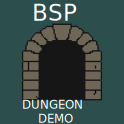

#  BSP Dungeon Demo-Godot



A simple procedural dungeon generator implemented in **GDScript** for **Godot Engine 4.5**.  
This project demonstrates the creation of interconnected rooms using **Binary Space Partitioning (BSP)** on a TileMapLayer node.

---

## Table of Contents

1. [Overview](#overview)
2. [Structure](#structure)
3. [Scripts](#scripts)
	- [Room.gd](#roomgd)
	- [Leaf.gd](#leafgd)
	- [MessageBus.gd](#messagebusgd)
	- [Generator.gd](#generatorgd)
4. [How It Works](#how-it-works)
5. [Usage](#usage)
6. [Notes](#notes)
7. [License](#license)

---

## Overview

This project generates a random dungeon map by recursively dividing a rectangular space into smaller rooms.  
Each leaf node may contain a *room*, and rooms are connected with corridors, resulting in a natural and organic layout suitable for roguelike or exploration games.

The system focuses on **clarity**, **simplicity**, and **expandability**.

---

## Structure
```
res://
├─ assets/
│  └─ tileset/
│     └─ basic_tileset.png
│
├─ resources/
│  └─ basic_tileset.tres
│
├─ scenes/
│  └─ demo_world.tscn
│
├─ scr/
│  ├─ data_structures/
│  │  ├─ room.gd
│  │  └─ leaf.gd
│  │
│  ├─ generator/
│  │  └─ generator.gd
│  │
│  └─ globals/
│     └─ message_bus.gd
│
├─ icon.svg
└─ readme.md
```
---

## Scripts

### Room.gd

Defines the basic rectangular space used for room generation.

**Key Features:**
- Calculates room size and center
- Supports random splitting along X or Y axis
- Provides scaling utilities

**Main Methods:**
- `_init(s: Vector2i, f: Vector2i)`
- `split(min_s: int)`
- `center() -> Vector2i`
- `scale(factor: int)`

---

### Leaf.gd

Represents a node in the BSP tree structure.  
Each leaf may contain a room or further subdivisions.

**Key Features:**
- Recursive subdivision (`startSeq`)
- Room creation with probability control
- Automatic connection of room centers via signal emission

**Main Methods:**
- `startSeq(min_s: int)`
- `getLeaves(room_chance: float, ensure_one: bool)`
- `connectLeaves()`
- `scale(factor: int)`

---

### MessageBus.gd

A lightweight signal bus used to decouple dungeon generation logic.  
Provides the signal `connectRooms(a: Vector2i, b: Vector2i)` for linking room centers.

---

### Generator.gd

Handles dungeon generation, map initialization, and rendering to the `TileMapLayer`.

**Key Features:**
- Initializes and fills the map grid
- Connects rooms using corridors
- Scales and cleans the map
- Converts logical map to tiles for display
- Manages camera positioning

**Main Constants:**
- `TILES { AIR, WALL, FLOOR }`
- `ROWS`, `COLS`, `scale_f`, `min_room_size`

---

## How It Works

1. The root `Room` covers the full map area.  
2. It is recursively split into smaller subrooms by `Leaf` nodes.  
3. Each leaf may contain a real room with a certain probability.  
4. Room centers are connected via corridors using the signal system.  
5. The final map is scaled, cleaned, and drawn to the `TileMapLayer`.  

This approach produces variable but coherent dungeon structures each run.

---

## Usage

1. Open the project in **Godot 4.5**.
2. Load the main scene.
3. Run the project.  
   A random dungeon map will be generated at startup.
4. Adjust parameters in `Main.gd`:
   - `min_room_size`
   - `scale_f`
   - `ROWS`, `COLS`

For consistent results, a random seed can be set before generation.

---

## Notes

- The algorithm is intentionally minimal, designed for readability and modification.  
- Corridor creation uses a simple L-shaped pattern.  
- Can be extended to support:
  - Room types (treasures, enemies, etc.)
  - Multi-floor structures
  - Tile-based decorations

---

## License

This project is released under the **MIT License**.  
Use freely for learning, modification, or inclusion in your own Godot projects.

---
